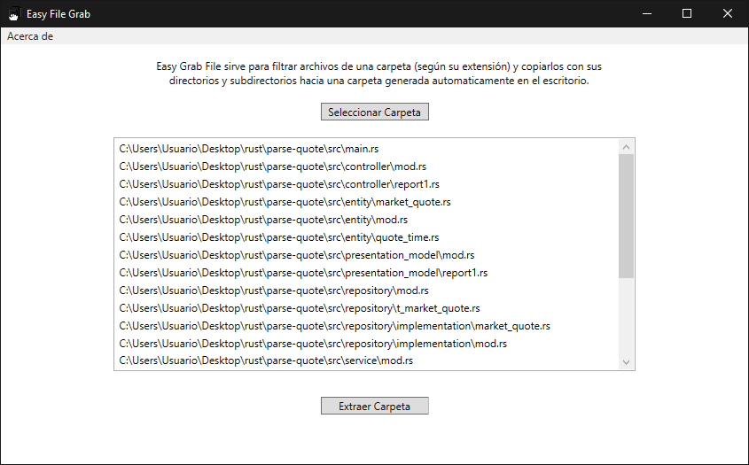

# Easy-File-Grab
Easy File Grab is a WPF application that allows you to extract any file with the specified extensions in "FileExtensions.json" alongside with their directories and subdirectories to a directory called "Easy File Grab" in the Desktop. Beware, for now the application is only in Spanish.

The main use of this software is to use it to extract source files from projects created by applications such as Visual Studio that create aditional files that you do not want to extract.

The main reason why I created this application was to help the students of my university when they want to save source files of their projects or send them at the end of exams quickly.

TLDR: It's a filter for your files and copies the same file structure to your desktop.

