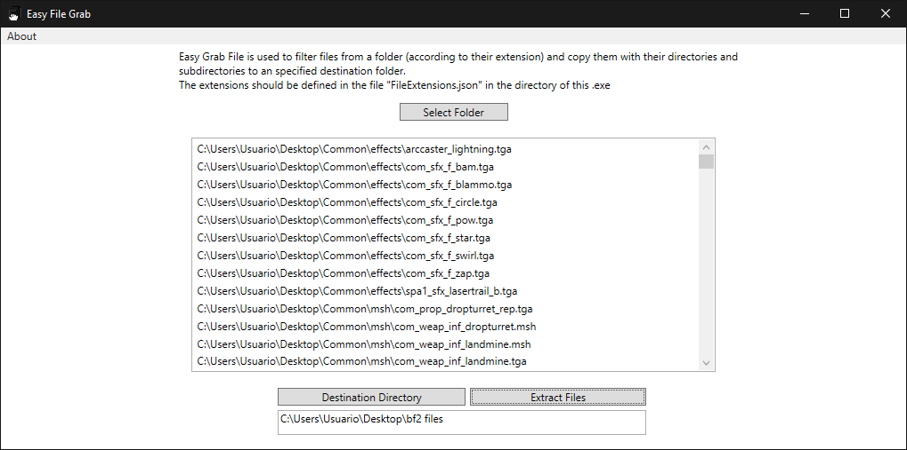

# Easy File Grab

  

Easy File Grab is a WPF and NET Framework 4.7.2 application that allows you to extract any file with the specified extensions in "FileExtensions.json" alongside with their directories and subdirectories to a directory called "Easy File Grab" in the Desktop.

The main use of this software is to use it to extract source files from projects created by applications such as Visual Studio that create aditional files that you may not want to extract.

